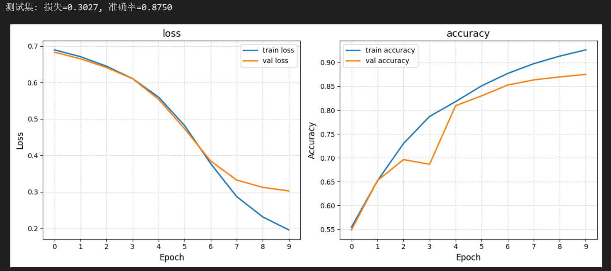

<!-- 两个徽标 -->

#### 教育背景
东北大学（秦皇岛）| 计算机科学与技术 | 2026届 
GPA  4.1399/5.0 | 绩点排名 22/191 
主修课程：高等数学（98），概率论与数理统计（98），C++（98），数据库原理（98），汇编语言（96），软件工程（93）

#### 科研经历

##### 1.基于FNet的文本分类任务
<b>项目地址</b>：https://github.com/X-futur/FNet-textClassify
<b>项目简介</b>：本项目基于`FNet`基本架构构建`IMDB电影评论`文本分类系统。 
<b>项目实现</b>：本项目设计了高效的文本分类模型。在数据处理阶段，将文本数据通过`填充或截取`统一长度为256的样本。同时在 `FNet`的基础上添加了残差块以解决深层网络训练时出现的梯度消失问题，实现了较为完善的`嵌入层-层归一化层-傅里叶变换层-前馈网络层-输出层`架构。最终模型在测试集上文本分类准确率达到`87.50%`，损失降低到了`30.27%`。 
<b>个人工作</b>：负责整个模型框架的搭建与模型的训练。 
<b>项目成果展示</b>： 

  

##### 2.基于Pytorch的花卉图像识别实战
<b>项目地址</b>：https://github.com/X-futur/Flower-image-recognition-based-on-PyTorch 
<b>项目简介</b>：本项目基于`PyTorch`框架构建花卉识别系统。 
<b>项目实现</b>：本项目设计了高效的`数据预处理流程`和`resNet50`神经网络架构。通过旋转图片，切割图片等`数据增强技术`扩展数据集，提高了模型训练的准确性；同时利用`迁移学习`方法加载了`resNet50`的预训练参数，提高了参数训练的效率。最终搭建出了在测试集上花卉识别准确率达到`74.94%`的花卉图像分类模型，为花卉图像分类任务提供了高效、可靠的解决方案。 
<b>个人工作</b>：负责整个模型框架的搭建与模型的训练 
<b>项目展示</b>：
测试集上图片分类效果如下： 

  

#### 项目经历
##### 1.学成在线静态界面开发
<b>部署地址</b>：https://xuechengzaixian666.netlify.app/ 
<b>代码地址</b>：https://github.com/X-futur/xuechengzaixian 
<b>项目简介</b>：根据提供的psd设计稿，基于`HTML、CSS`进行“学成在线”课程网站的界面开发和绘制 
<b>项目特性</b>：采用语义化`HTML`标签、优化`SEO`三大标签提升可读性与SEO友好性。页面分模块开发（导航、轮播图、课程卡片等），代码结构清晰。通过`CSS3`生成动画（如过渡效果、悬浮特效）增强用户体验。遵循`W3C`标准，兼容主流浏览器（Chrome、Firefox、IE8及以上等）。 
<b>界面展示</b>： 

##### 2.小兔鲜静态界面开发
<b>部署地址</b>：https://xiaotuxian.netlify.app/ 
<b>代码地址</b>：https://github.com/X-futur/xiaotuxian 
<b>项目简介</b>：基于`HTML、CSS、Javascript`等进行“小兔鲜”电商购物网站的界面开发和绘制 
<b>项目特性</b>：模拟生鲜电商平台（如商品展示、购物车、分类导航），聚焦电商常见UI组件开发。页面实现`模块化开发`，封装通用组件，代码结构清晰易懂。通过原生`JavaScript`实现动态功能（如轮播图支持自动切换等）。 
<b>界面展示</b>： 

#### 实践经历
校“东弈棋牌俱乐部”部门负责人 
校三好学生标兵 
校社会实践活动先进个人 
校军事训练活动“先进个人” 
23级新生辅导员助理 
班级组织委员、生活委员 

#### 荣誉奖项
国家励志奖学金 
校综合二等奖学金  
校综合三等奖学金 
科创奖学金 
全国大学生数学建模竞赛国家级二等奖 
蓝桥杯全国软件和信息技术专业人才大赛省级三等奖 

#### 荣誉证书
<!-- 奖学金、比赛、荣誉称号、社会工作、 -->
<!-- 奖学金 -->
奖学金证书 

<!-- 比赛 -->
比赛获奖证书 

<!-- 荣誉称号 -->
荣誉称号证书 

<!-- 社会工作 -->
社会实践证书 

<!-- 考级证书 -->
专业能力证书 

<!-- 班级荣誉 -->
班级荣誉证书 

