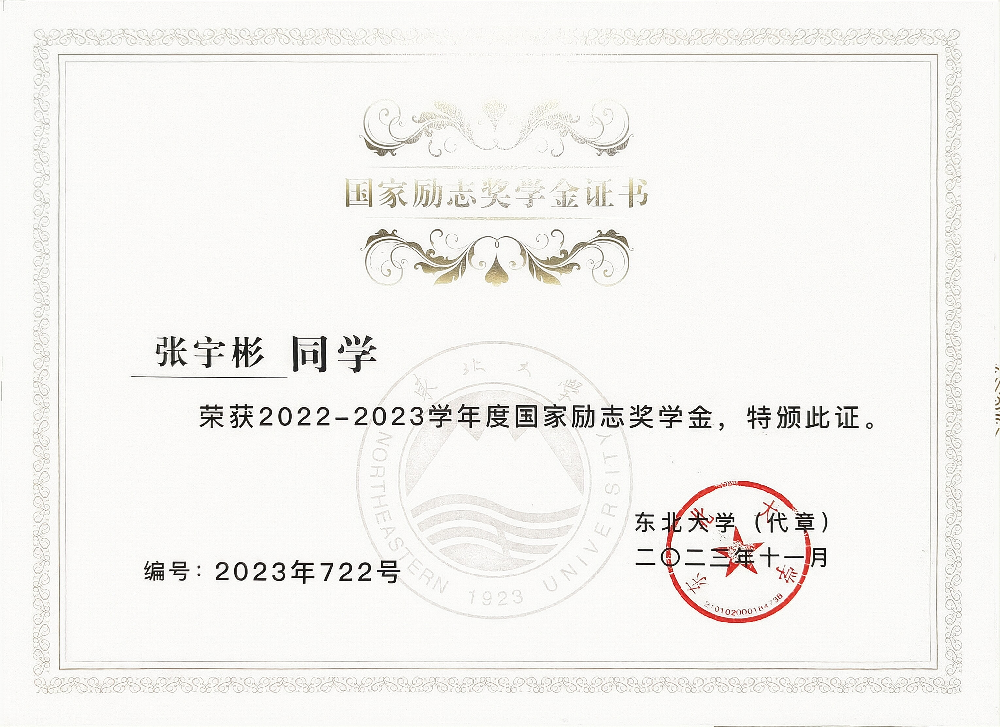
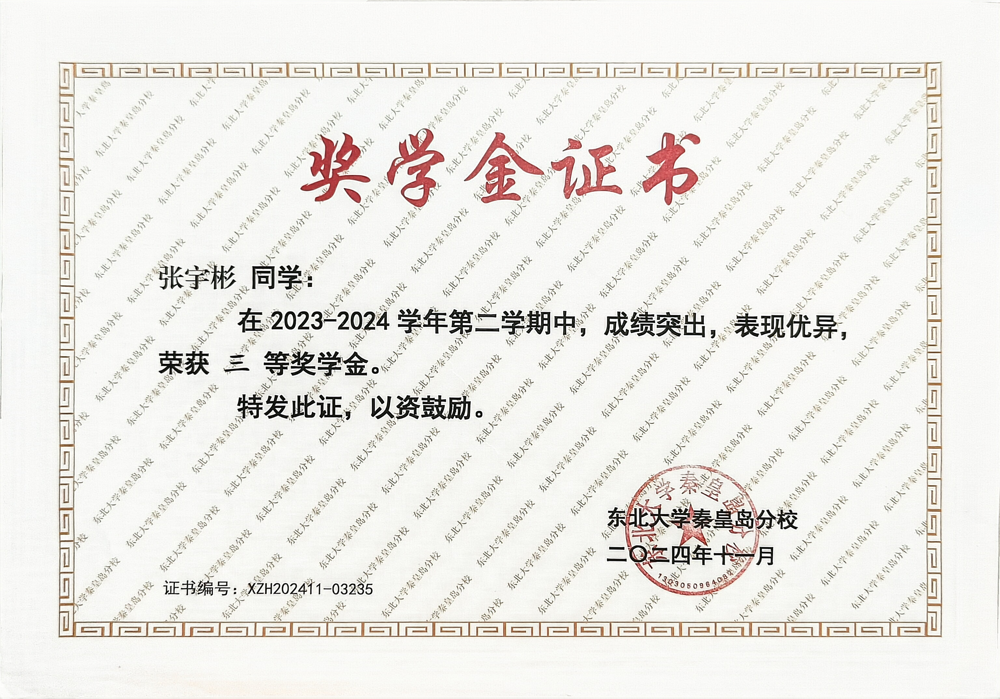
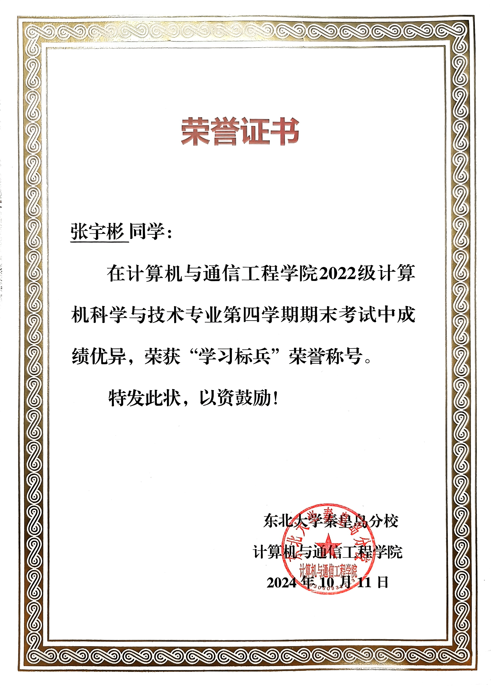
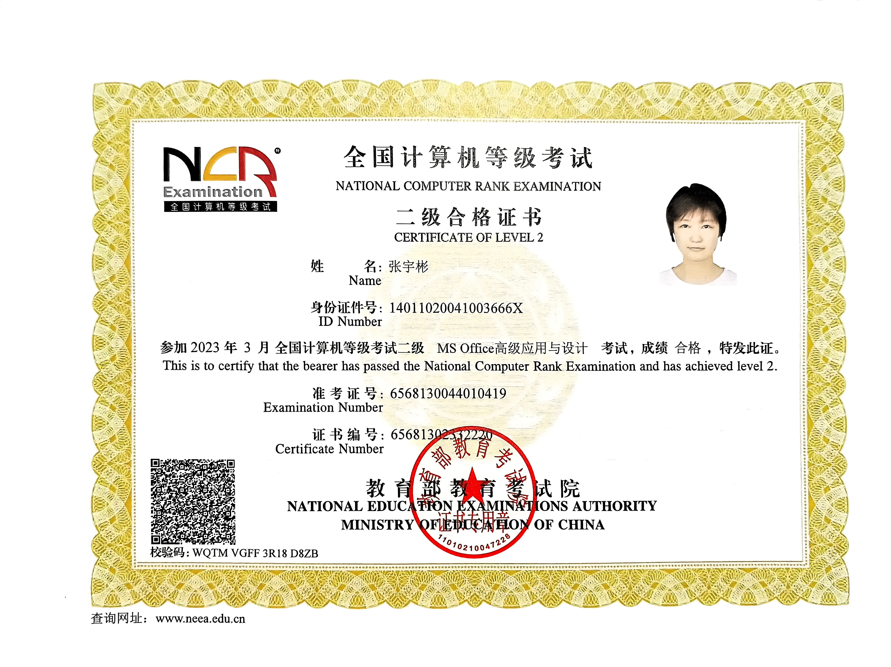

<!-- 两个徽标 -->

#### 教育背景
东北大学（秦皇岛）| 计算机科学与技术| 2026届
GPA  4.1399/5.0    绩点排名 21/191

#### 主修课程
高等数学（98），概率论与数理统计（98），C++（98），数据库原理（98），汇编语言（96），软件工程（93）

#### 科创经历
暂时空着，之后回来填

#### 项目经历
暂时空着，之后回来填

#### 实践经历
校“东弈棋牌俱乐部”部门负责人   
校三好学生标兵                               
校社会实践活动先进个人                
校军事训练活动“先进个人”         
23级新生辅导员助理  

#### 荣誉奖项
国家励志奖学金 1 次 ；校综合二等奖学金 ；校综合三等奖学金 ；科创奖学金 
全国大学生数学建模竞赛国家级二等奖 
蓝桥杯全国软件和信息技术专业人才大赛省级三等奖 

#### 荣誉证书
<!-- 奖学金、比赛、荣誉称号、社会工作、 -->
<!-- 奖学金 -->
奖学金证书 

<!-- 比赛 -->
比赛获奖证书 

<!-- 荣誉称号 -->
荣誉称号证书 

<!-- 社会工作 -->
社会实践证书 

<!-- 考级证书 -->
专业能力证书 

<!-- 班级荣誉 -->
班级荣誉证书 

